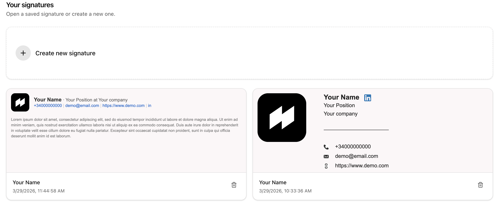
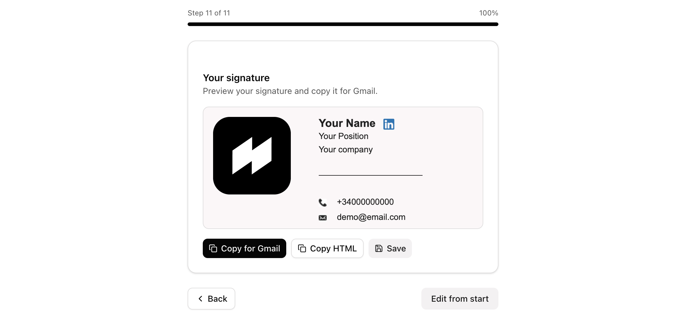
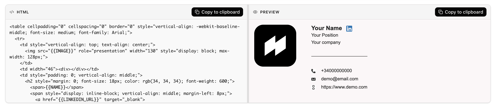

# Email Signature Editor

[](https://opensource.org/licenses/MIT)
[](https://www.typescriptlang.org/)
[](https://github.com/xarlizard/email-signature-editor/actions/workflows/ci.yml)
[](https://github.com/xarlizard/email-signature-editor/actions/workflows/deploy.yml)

Edit HTML email signatures with a live preview, then copy into Gmail.

**[→ Live demo](https://email-signature-editor.pages.dev/)**

---

## Features

### Simple mode (default)

- **Library** – Saved signatures in the browser (localStorage), card previews, create new or open an existing one
- **Guided flow** – Choose a template, fill fields step by step, then review with **Copy for Gmail** / **Copy HTML** / **Save**
- **Template picker** – Visual previews for each built-in template

### Advanced mode

- **Values** – All fields on one screen (name, position, company, LinkedIn, phone, email, website, image)
- **HTML editor** – Edit the template with `{{VARIABLE}}` highlighting
- **Resizable panels** – Horizontal or vertical layout toggle
- **Template selector** – In the header (hidden in simple mode)

### Shared

- **Templates** – Several styles (default, minimal, modern, compact, bold, elegant)
- **Copy** – Rich HTML for Gmail where supported, plus plain HTML string copy
- **Internationalization** – English, Spanish, French, German, Italian, Dutch, Catalan, Russian, Chinese
- **Theme** – Light / dark
- **UI** – React, Vite, TypeScript, Tailwind CSS, shadcn/ui

Use **Simple** / **Advanced** in the header to switch modes (preference is stored locally).

---

## Screenshots

### Library (home)

The **Your signatures** screen is where you land in simple mode. You can open any saved signature from the cards (each shows a live preview, title, and timestamp) or start the creation flow with **Create new signature**.



### Simple mode – review

At the end of the guided flow, after choosing a template and filling in your details, the **Review** step shows a full preview of the finished signature. From here you can **Copy for Gmail**, **Copy HTML**, or **Save** back to the library. Use **Edit from start** to walk through the steps again.



### Advanced mode

**Advanced mode** shows the raw template in an **HTML** panel beside a **live preview**. Edit `{{VARIABLE}}` placeholders and markup directly; the preview updates as you work. Switch layout (horizontal or vertical) from the header if you prefer the editor above the preview.



---

## Quick Start

**[Try it online](https://email-signature-editor.pages.dev/)** or run locally:

```bash
npm install
npm run dev
```

Open [http://localhost:5173](http://localhost:5173) in your browser.

---

## Usage

### Simple mode

1. Open the **library** – create a new signature or pick a saved one
2. **Choose a template**, then complete each field
3. On **Review**, copy for Gmail or copy HTML, and **Save** to the library if you want

### Advanced mode

1. Optionally pick a **template** in the header
2. Fill **Values** and/or edit the **HTML**
3. Use **Copy** on the HTML or Preview panel
4. In Gmail: **Settings** → **See all settings** → **General** → **Signature** → paste

---

## Scripts

| Script              | Description                  |
| ------------------- | ---------------------------- |
| `npm run dev`       | Start development server     |
| `npm run build`     | Build for production         |
| `npm run preview`   | Preview production build     |
| `npm run lint`      | Run ESLint                   |
| `npm run typecheck` | Run TypeScript type check    |

---

## Project structure

```
src/
├── App.tsx                 # Layout, modes, clipboard
├── components/             # Panels, simple mode, header, footer
├── i18n/locales/           # Translation JSON files
├── lib/                    # Saved signatures, preview helpers
├── templates/              # Built-in HTML templates + resolver
├── types.ts
└── utils/highlight.ts      # {{VAR}} highlighting in editor
```

---

## Development

- Clone: `git clone https://github.com/xarlizard/email-signature-editor.git`
- Install: `npm install`
- Dev: `npm run dev`
- Build: `npm run build`

---

## Contributing

Contributions are welcome. Please open [issues](https://github.com/xarlizard/email-signature-editor/issues) or [pull requests](https://github.com/xarlizard/email-signature-editor/pulls).

---

## License

MIT © [xarlizard](https://github.com/xarlizard)
